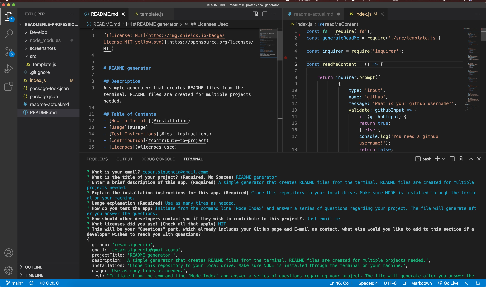
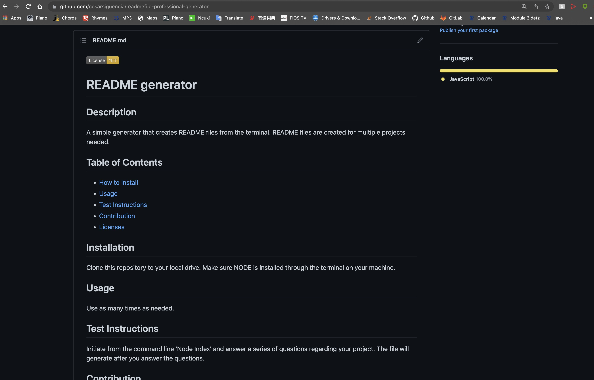

# README File Generator by CS 

Need a README? This project regenerates README files instantly from your computer's command line. Simply provide important info regarding your project, such as your github username, contact info, licenses used in project, and details of the project. Then, upload your generated README to the repository of your choice.

To see a sample of a generated README, there is one included at the root titled 'generated-README.md' that I created using the app. 

### Installation
- Clone the application to your local drive, open the command line with the application at the root and run 'Node index.js'

- After you have completed answering all your questions, the generated README will appear at the root as 'generated-README.md'

### Tutorial Link
[Link to Tutorial](https://drive.google.com/file/d/1dDOObMUn-SSuRPp826UlG1dgLZNsSkJW/view?usp=sharing)

### Screenshot

