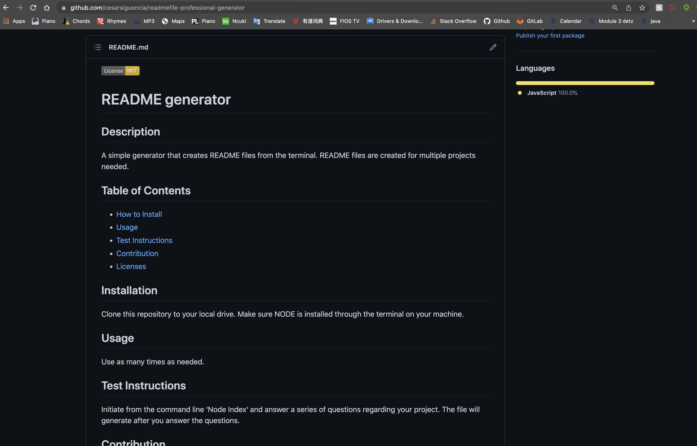

# Welcome to Cesar's README File Generator

Need a README? This project regenerates README files instantly from your computer's terminal. Simply provide important info regarding your project, such as your github username, contact info, licenses used in project, and details of the project. Then, upload your generated README to the repository of your choice.

### Website Link
[Link to Online Repository](https://github.com/cesarsiguencia/readmefile-professional-generator.git)

### Tutorial Link
[Link to Tutorial](https://drive.google.com/file/d/1dDOObMUn-SSuRPp826UlG1dgLZNsSkJW/view?usp=sharing)

### Screenshot

